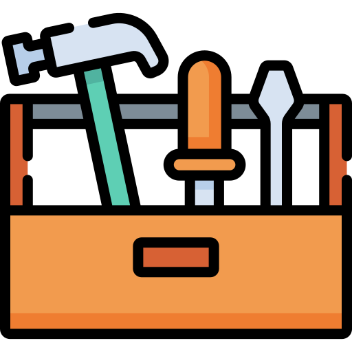
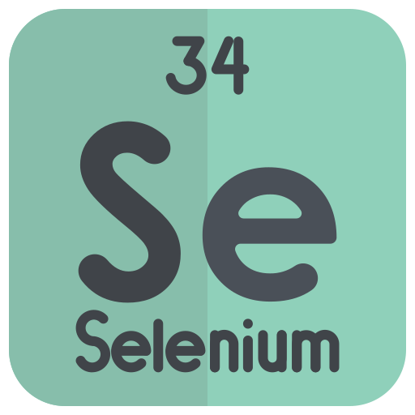
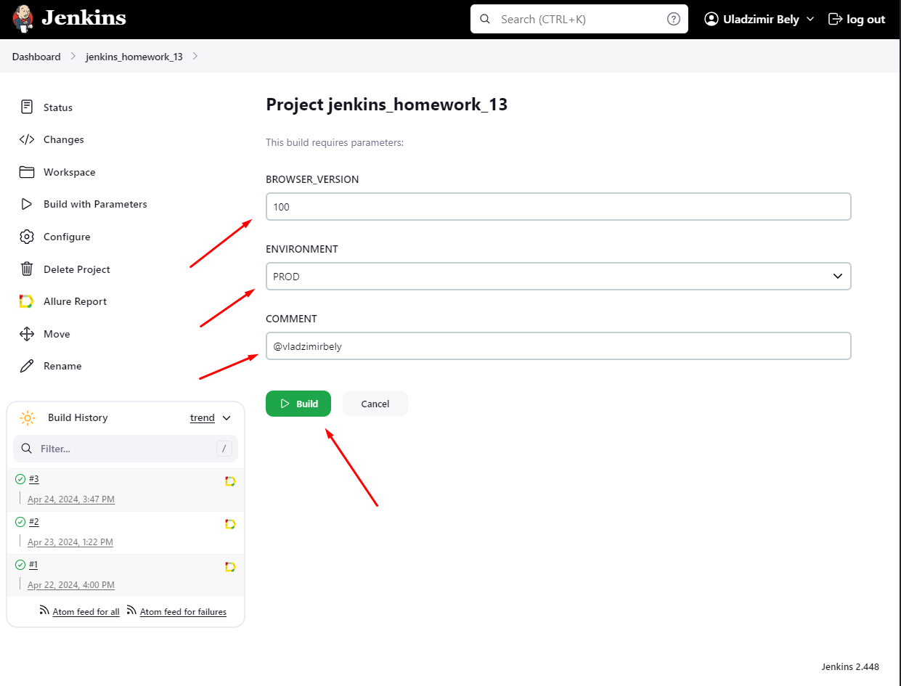
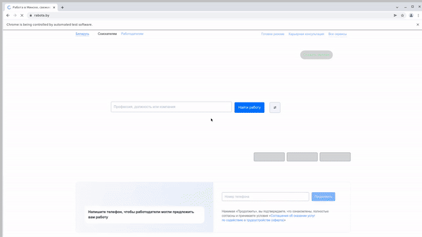

<h1>Tests for automated testing of the <font color="#e63f39">rabota.by</font> website</h1>

---

<p align="center">
    
</p>

<h2> Description</h2>
* [Tools](#tools)
* [Tests](#tests)
* [Run tests](#run-tests)
* [Example of passing test](#test-example)
* [Telegram notifications](#telegram-notification)

---

<h2 id="tools"> Tools</h2>
<div align="center">
    
    
    
    
    
    
    
    
    
    
</div>
<p>Autotests are written in <b>Python</b> using <b>Selenide</b> for <i>UI tests</i></p>
<p>Tests are run from <b>Jenkins</b></p>
<p><b>Selenoid</b> is used to launch the browser</p>
<p><b>Allure report</b> is generated and sent to telegram</p>

---

<h2 id="tests"> Tests</h2>
-[x] Search login
-[x] Type text in input
-[x] Click signup
-[x] Click filter
-[x] Click search employees button

---

<h2 id="run-tests"> Run tests</h2>
```
python -m venv .venv
source .venv/bin/activate
pip install -r requirements.txt
pytest . --browser_version=${BROWSER_VERSION}
```
<p><font color="#0cf5ab">Parameters</font>: 
    <li>BROWSER_VERSION - browser version in which the tests will be run</li>
</p>

---

<p>To run tests in Jenkins you need to click on <b>Build with Parameters</b> button</p>

<p>Сhoose parameters (<i>BROWSER_VERSION, ENVIRONMENT, COMMENT</i>) and click on <b>"Build"</b> button</p>

<p>After passing the tests report will be generated, you can see it by clicking on the <b>Allure report</b></p>


---

<h2 id="test-example">Example of passing employee search test</h2>


---

<h2 id="telegram-notification">Telegram notifications</h2>

